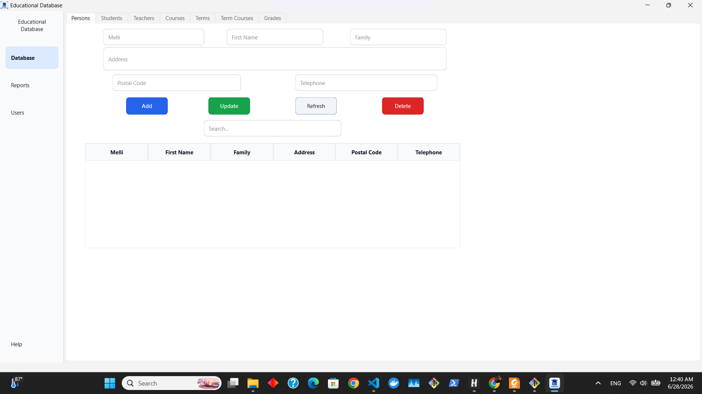
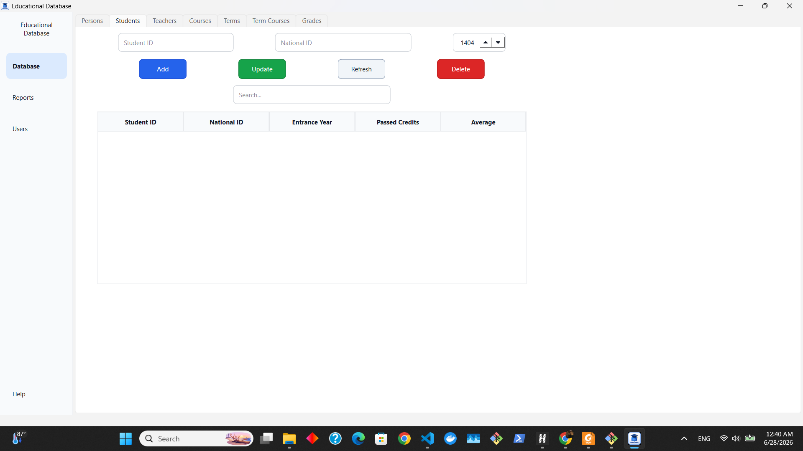
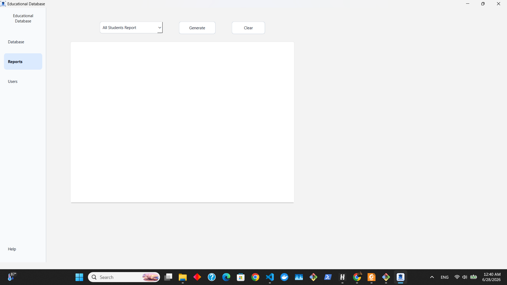
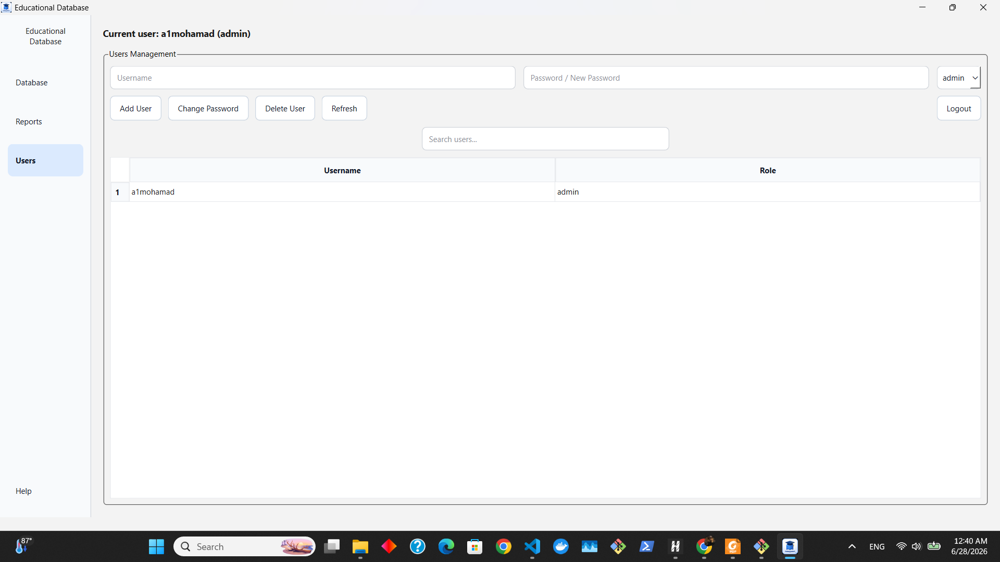
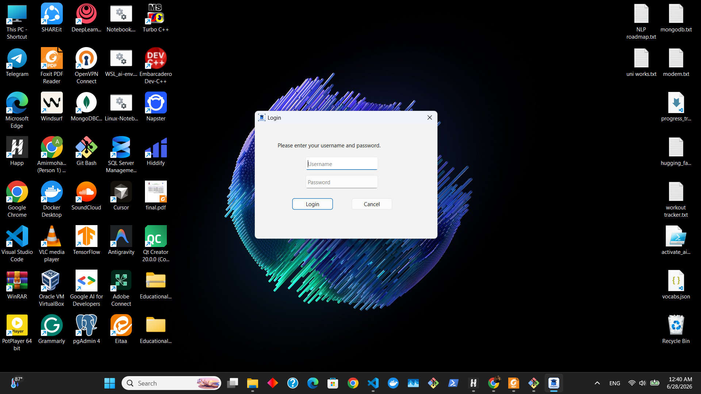

# Educational Database

[](https://www.qt.io/download-dev)
[](https://isocpp.org/)
[](https://cmake.org/download/)
[](https://www.microsoft.com/windows)
[](LICENSE)
[](https://github.com/a1mohamad/educational-database-qt/releases/latest)
[](https://a1mohamad.github.io)

**Educational Database** is a Qt/C++ desktop application for managing educational records through a clean Windows-style graphical interface. It supports person, student, teacher, course, term, term-course, grade, report, authentication, and user-management workflows.

The application is built with **C++**, **Qt 6 Widgets**, and **CMake**. It uses a lightweight local file-based persistence layer, so it can run without installing a separate database server.

---

## Download

The latest portable Windows release is available from the GitHub Releases page:

[Download Educational Database for Windows x64](https://github.com/a1mohamad/educational-database-qt/releases/latest)

To run the application:

1. Download `EducationalDatabase-v1.0.0-Windows-x64.zip`.
2. Extract the ZIP file.
3. Open the extracted folder.
4. Double-click `educational-database.exe`.

> Do not move the `.exe` file outside the extracted folder. The Qt runtime files, plugin folders, and local data files must stay beside the executable.

---

## Application Preview


---

## Screenshots

### Person Management



### Student Management



### Reports



### User Management



### Login



---

## Table of Contents

* [Overview](#overview)
* [Features](#features)
* [Application Modules](#application-modules)
* [User Roles](#user-roles)
* [First Run Login Flow](#first-run-login-flow)
* [Data Storage](#data-storage)
* [Project Structure](#project-structure)
* [Build Requirements](#build-requirements)
* [Build from Source](#build-from-source)
* [Run the Application](#run-the-application)
* [Packaging for Developers](#packaging-for-developers)
* [Repository Hygiene](#repository-hygiene)
* [Developer Notes](#developer-notes)
* [Current Scope and Limitations](#current-scope-and-limitations)
* [License](#license)

---

## Overview

This project provides a desktop-based educational records system with a structured graphical interface. It is designed for local academic database-management scenarios where users need to manage people, students, teachers, courses, academic terms, offered courses, grades, users, and reports.

The application is organized around three main sidebar sections:

| Section      | Purpose                                                 |
| ------------ | ------------------------------------------------------- |
| **Database** | Main CRUD interface for educational records             |
| **Reports**  | Generates formatted reports from the current data files |
| **Users**    | Manages login accounts, roles, passwords, and logout    |

The database interface contains separate tabs for each entity, making the system easier to navigate and maintain.

---

## Features

### Database Management

* Manage personal identity records.
* Manage students and connect each student to an existing person record.
* Manage teachers and connect each teacher to an existing person record.
* Manage courses with credit values.
* Manage academic terms.
* Manage term-course assignments by connecting terms, courses, and teachers.
* Manage grades by connecting students to term courses.
* Search records directly inside each table.
* Select rows to automatically fill update/delete forms.
* Prevent invalid deletion when a record is already used by another module.
* Automatically recalculate student passed credits and weighted average after grade or course changes.

### Reports

The reports section can generate:

* All Students Report
* All Teachers Report
* All Courses Report
* All Terms Report
* All Term Courses Report
* All Grades Report
* Student Performance Report
* Failed Students Report
* Passed Students Report

Reports are rendered inside the application using formatted HTML tables.

### Authentication and User Management

* Login dialog before entering the application.
* Temporary first-run admin login.
* First real admin account creation after initial login.
* Admin and normal user roles.
* User creation, password change, deletion, refresh, and search.
* Protection against deleting the last admin user.
* Protection against deleting the currently logged-in user.
* Passwords are stored as hashes instead of plain text.

### User Interface

* Qt Widgets desktop interface.
* Sidebar navigation for Database, Reports, and Users.
* Styled buttons, tables, inputs, and navigation items.
* Role-based access control in the interface.
* Jalali calendar support for teacher hire dates.

---

## Application Modules

| Module           | Description                                                                                                               |
| ---------------- | ------------------------------------------------------------------------------------------------------------------------- |
| **Persons**      | Stores national identity information, including Melli code, first name, family name, address, postal code, and telephone. |
| **Students**     | Stores student ID, connected Melli code, entrance year, passed credits, and average grade.                                |
| **Teachers**     | Stores teacher ID, connected Melli code, and hire date.                                                                   |
| **Courses**      | Stores course ID, course name, and course credits.                                                                        |
| **Terms**        | Stores term ID, term name, and academic year.                                                                             |
| **Term Courses** | Connects a term, course, and teacher into an offered course.                                                              |
| **Grades**       | Stores student grades for specific term courses and calculates passed credits.                                            |
| **Reports**      | Produces formatted reports from current data files.                                                                       |
| **Users**        | Handles login accounts and role-based permissions.                                                                        |

---

## User Roles

| Role      | Permissions                                                                     |
| --------- | ------------------------------------------------------------------------------- |
| **admin** | Can add, update, delete, search, refresh, generate reports, and manage users.   |
| **user**  | Can view, search, refresh, and generate reports. Mutation actions are disabled. |

The application applies permissions after login. Admin-only controls are disabled for normal users.

---

## First Run Login Flow

When the application is launched for the first time and no real user account exists, it allows a temporary admin login:

```text
Username: admin
Password: admin123
```

After logging in with the temporary admin account, the application asks the user to create the first real admin account. The temporary account is not saved to `users.dat`.

After the first admin account is created, future logins must use real accounts stored by the application.

---

## Data Storage

The application uses text files as a lightweight local persistence layer. Runtime data is expected beside the executable, because the application sets its working directory to the executable directory at startup.

At runtime, the application uses this structure:

```text
<application-directory>/
├── educational-database.exe
├── database/
│   ├── students.txt
│   ├── teachers.txt
│   ├── courses.txt
│   ├── terms.txt
│   ├── term_courses.txt
│   ├── grades.txt
│   ├── national_core.txt
│   └── national_details.txt
└── system_files/
    └── users.dat
```

If the folders or files do not exist, the application creates them automatically.

### Database File Formats

Records are stored as pipe-separated text lines using the `|` character as the delimiter.

| File                   | Format                                                 |
| ---------------------- | ------------------------------------------------------ |
| `national_core.txt`    | `melli\|firstName\|family`                             |
| `national_details.txt` | `melli\|address\|postalCode\|telephone`                |
| `students.txt`         | `studentId\|melli\|entranceYear\|passed\|grade`        |
| `teachers.txt`         | `teacherId\|melli\|hireDate`                           |
| `courses.txt`          | `courseId\|courseName\|credits`                        |
| `terms.txt`            | `termId\|termName\|year`                               |
| `term_courses.txt`     | `termCourseId\|termId\|courseId\|teacherId`            |
| `grades.txt`           | `gradeId\|termCourseId\|studentId\|gradeValue\|passed` |
| `users.dat`            | `username\|passwordHash\|role`                         |

Because `|` is the storage delimiter, the application blocks this character in user input.

---

## Project Structure

```text
educational-database-qt/
├── CMakeLists.txt
├── README.md
├── LICENSE
├── main.cpp
├── mainwindow.h
├── mainwindow.cpp
├── mainwindow.ui
├── reportdialog.h
├── reportdialog.cpp
├── reportdialog.ui
├── logindialog.h
├── logindialog.cpp
├── logindialog.ui
├── firstadmindialog.h
├── firstadmindialog.cpp
├── firstadmindialog.ui
├── authmanager.h
├── authmanager.cpp
├── resources.qrc
├── app.rc
├── app_icon.ico
├── assets/
│   └── screenshots/
└── backend/
    ├── structures.h
    ├── fileIO.h
    └── fileIO.cpp
```

### Important Runtime Note

The `.txt` database files and `users.dat` are runtime files. In a built Qt application, they should exist under the build or release folder:

```text
build-or-release-folder/
├── database/
│   └── *.txt
└── system_files/
    └── users.dat
```

Do not rely on the source root as the runtime data location after deployment. The executable uses its own directory as the working directory.

---

## Build Requirements

To build the project from source, install:

* Qt 6.5 or newer
* CMake 3.19 or newer
* A C++ compiler supported by your Qt kit
* Qt Creator, Visual Studio, or another CMake-compatible IDE

This project uses the following Qt components:

```cmake
Qt6::Core
Qt6::Widgets
```

---

## Build from Source

Clone the repository:

```bash
git clone https://github.com/a1mohamad/educational-database-qt.git
cd educational-database-qt
```

Configure the project:

```bash
cmake -S . -B build
```

Build the project:

```bash
cmake --build build --config Release
```

The executable location depends on the selected generator and Qt kit. Common output locations include:

```text
build/Release/educational-database.exe
build/educational-database.exe
```

You can also open the project directly in Qt Creator using `CMakeLists.txt`.

---

## Run the Application

After building, run the executable from the build or release directory.

On first launch, the application creates the required runtime folders and files if they do not already exist:

```text
database/
system_files/
```

Then login using the first-run temporary admin account:

```text
Username: admin
Password: admin123
```

After that, create the first real admin account and continue using the application normally.

---

## Packaging for Developers

For a public GitHub release, build the project in Release mode and package the final executable together with the required Qt runtime files and runtime data folders.

A recommended release layout is:

```text
EducationalDatabase-v1.0.0-Windows-x64/
├── educational-database.exe
├── README.txt
├── LICENSE.txt
├── database/
│   ├── students.txt
│   ├── teachers.txt
│   ├── courses.txt
│   ├── terms.txt
│   ├── term_courses.txt
│   ├── grades.txt
│   ├── national_core.txt
│   └── national_details.txt
├── system_files/
│   └── created automatically on first launch
├── platforms/
│   └── qwindows.dll
└── Qt runtime DLLs...
```

On Windows, Qt applications normally require Qt DLLs and plugin folders beside the executable. A common deployment workflow is:

```bash
windeployqt path/to/educational-database.exe
```

The project also contains CMake deployment support through `qt_generate_deploy_app_script`. After building, installation/deployment can be attempted with:

```bash
cmake --install build --config Release --prefix dist
```

Depending on the Qt kit and generator, the installed files may be placed directly in `dist/` or inside a subfolder such as `dist/bin/`.

### Security Note

Do not publish a real `system_files/users.dat` file from your own machine if it contains real usernames or password hashes. For a public release, remove `users.dat` and let the application create a clean one on first launch, unless you intentionally provide a documented demo account.

---

## Repository Hygiene

Generated build folders, compiled binaries, Qt Creator user settings, deployment DLLs, and private runtime files should not be committed to the repository. They are build or machine-specific artifacts.

The repository should keep:

* Source code
* UI files
* CMake configuration
* Resources
* Documentation
* Screenshots
* License

The repository should exclude:

* `build/`
* `cmake-build-*/`
* `*.exe`
* `*.dll`
* `*.user`
* private `system_files/users.dat`
* local archive files such as `*.zip`

If sample data is needed, keep it clearly separated, for example:

```text
sample_data/
└── database/
    └── *.txt
```

Then document how users can copy sample data into the runtime `database/` folder.

---

## Developer Notes

### Main Classes and Files

| File                   | Responsibility                                                                                                    |
| ---------------------- | ----------------------------------------------------------------------------------------------------------------- |
| `main.cpp`             | Application startup, runtime folder preparation, login flow, first-admin flow, and main window loop.              |
| `mainwindow.*`         | Main application UI, database tabs, sidebar navigation, CRUD operations, search, role permissions, and user page. |
| `reportdialog.*`       | Report selection and HTML report generation.                                                                      |
| `logindialog.*`        | Login dialog and temporary first-run login handling.                                                              |
| `firstadmindialog.*`   | First real admin account creation.                                                                                |
| `authmanager.*`        | User storage, password hashing, login validation, account creation, deletion, and password changes.               |
| `backend/structures.h` | Core data structures used by the database layer.                                                                  |
| `backend/fileIO.*`     | Serialization, deserialization, text-file reading/writing, and helper lookup functions.                           |

### Data Relationships

The application uses simple relationships between records:

```text
Person
├── Student   uses Person.melli
└── Teacher   uses Person.melli

TermCourse
├── Term      uses termId
├── Course    uses courseId
└── Teacher   uses teacherId

Grade
├── Student       uses studentId
└── TermCourse    uses termCourseId
```

When grades are added, updated, or deleted, student statistics are recalculated. A grade value of `10.0` or higher is considered passed, and passed credits are calculated from the related course credits.

---

## Current Scope and Limitations

This project is designed as a local desktop educational database application. Its current architecture intentionally uses text files instead of a database server.

Current scope:

* Local desktop usage
* Single-machine data files
* Role-based local login
* Text-file persistence
* Academic and educational database workflows

Current limitations:

* No network synchronization
* No multi-user database server
* No automatic cloud backup
* No advanced audit logging
* File format depends on the `|` delimiter

For a larger production system, a natural technical upgrade would be replacing the text-file persistence layer with SQLite or another relational database system.

---

## License

This project is licensed under the MIT License.

See the [LICENSE](LICENSE) file for details.
